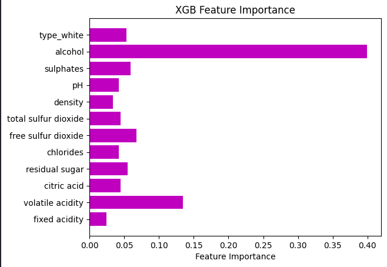
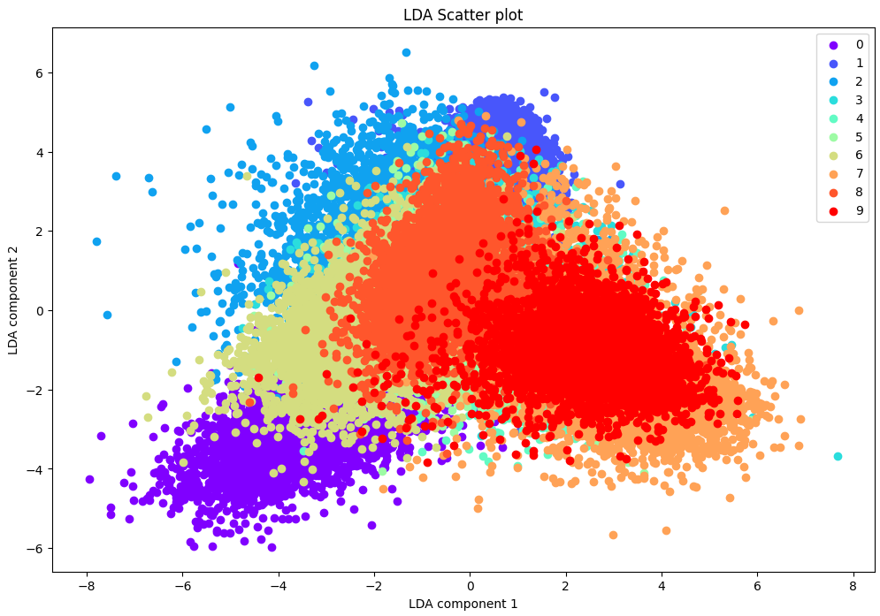

# 🍷 Wine Quality & ✍️ MNIST Classification Projects

This repository contains two distinct projects focused on **feature importance** and **dimensionality reduction**. 

---

## 🍷 **Wine Quality Prediction**  

### 📊 Dataset & Goal  
- **Dataset**: `wine-full.csv` (chemical features of red/white wines, including `quality` as a target).  
- **Goal**: Predict wine quality (regression problem) using features like `alcohol`, `volatile acidity`, etc.  

### 🔀 Workflow  
1. **EDA & Preprocessing**: Cleaned data and prepared it for model training.  
2. **Model Training**:  
   - Trained **Lasso Regression** and **Random Forest** models.  
   - Evaluated using **MAE** and **R² score**.  
3. **Feature Importance Analysis**:  
   - Compared feature rankings from **Lasso coefficients**, **Random Forest**, **permutation importance**, and **XGBoost**.  
   - **Top 3 Most Important Features** (majority vote): `volatile acidity`, `alcohol`, and `free sulfur dioxide`.  

    

---

## ✍️ **MNIST Digit Classification**  

### 📊 Dataset & Goal  
- **Dataset**: MNIST (28x28 grayscale images of handwritten digits 0-9).  
- **Goal**: Classify digits accurately using KNN and dimensionality reduction techniques.  

### 🔀 Workflow  
1. **Preprocessing**:  
   - Reshaped images from (28, 28) to (1, 784) vectors.  
   - Scaled pixel values.  
2. **KNN Classifier**:  
   - Tested varying `k` values to optimize accuracy.  
   - Achieved **~97% accuracy** with `k=3`.  
3. **Dimensionality Reduction**:  
   - **PCA**: Reduced training time while keeping similar performance.  
   - **LDA**: Used for both dimensionality reduction and classification. Visualized data in 2D space:  

    

---

## 🔬 **Key Takeaways**  
- **Wine Quality**: Feature importance varies by model, but `alcohol` and `volatile acidity` are consistently critical.  
- **MNIST**: Dimensionality reduction (PCA/LDA) boosts efficiency without sacrificing performance.

## 🛠️ Tools Used:
Scikit-learn, Pandas, Matplotlib/Seaborn, XGBoost.  

---
